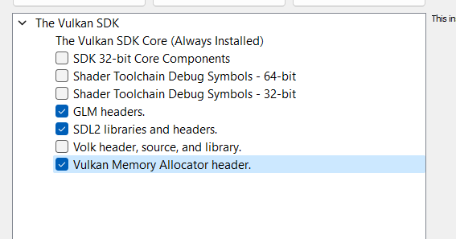

# DZGEngine
2D Renderine(possible game) engine in C++ written using VulkanAPI

Used libraries:
    GLM (mathematics)
    GLFW (windowing and input library)
    STB_Image ( Image loading library)
    Tiny Obj Loader (.obj loader library)
    VkBootstrap (boilerplate code abstraction)
    VMA (Vulkan memory allocator)

Setup to run the project:

    #1 Download VulkanSDK https://vulkan.lunarg.com/sdk/home#windows
        Select these components during installation:
        

        To confirm the installation -> open the Bin folder in the installation directory and run vkcube.exe
        If you see an image like this it means it went well:
        
    
    #2 Download GLFW https://www.glfw.org/download.html

        Download precompiled binaries

    #3 Add appropriate directories to C++->General->"Additional include directiories" under project properties in Visual Studio
        
    
    #4 Add appropriate paths to Linker->General->Additional Library directories
        
    
    #5 Set proper path
        
        In "resources/compile.bat" set a proper to glslc.exe for shader compilation

        example: set "glslcPath=C:\VulkanSDK\1.3.283.0\Bin\glslc.exe"

